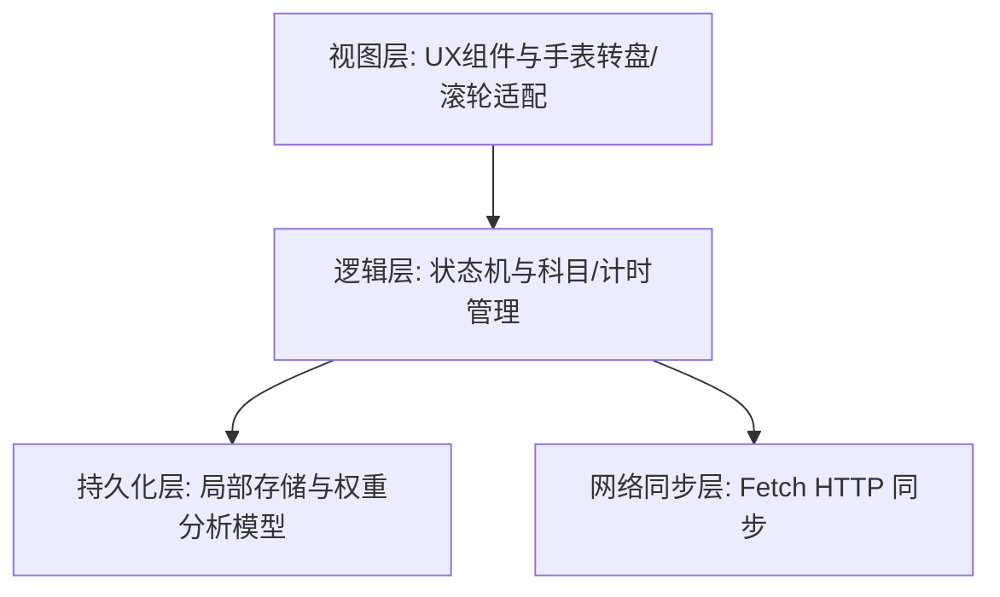

# PerseusFocus - RedmiWatch6 学习时间统计应用架构方案

本文档为 **PerseusFocus** 针对 **RedmiWatch6** 智能手表深度定制的学习时间统计应用技术方案与系统架构设计。

---

## 一、 系统架构设计

本应用基于快应用（QuickApp / 华为快应用标准适配手表端）架构进行轻量化、高性能设计，整体划分为四个核心分层：



---

## 二、 核心功能模块设计

### 1. 适配 RedmiWatch6 屏幕与滚轮滑动的高性能界面
- **圆屏/方屏自适应**：采用 `designWidth: device-width` 动态流式布局，针对手表小屏优化字号与触摸热区。
- **滚轮/滑动交互**：引入高性能滑动列表组件，减少复杂 DOM 嵌套，确保在手表芯片上滚动帧率稳定。
- **动画轻量化**：通过 CSS transform 与 opacity 进行过渡，避免重排（Reflow）引发的卡顿。

### 2. 科目管理与 6 大科目分类
- **科目列表**：内置语文、数学、英语、物理、化学、生物。
- **权重配置体系**（用于规划分析）：
  - 语文：权重 1.5（最高）
  - 数学：权重 1.4
  - 英语：权重 1.3
  - 物理：权重 1.2
  - 化学：权重 1.1
  - 生物：权重 1.0

### 3. 双模时间记录方式
- **计时器模式**：提供“标记开始”、“标记结束”、“实时秒表展示与时间差计算”，支持后台挂起或定时器状态保存。
- **手动输入模式**：提供快速数字加减或步进选择，允许用户直接补录学习时长。

### 4. 统计看板页
- **多维度展示**：按日、周展示各科目累计学习时长。
- **占比分析**：直观展示各科目时间消耗百分比。

### 5. 智能规划与失衡分析算法
- **投入比重计算**：结合预设科目权重计算“加权学习分值”。
- **失衡诊断**：对比标准期望权重，自动识别“投入过少”的弱势科目与“投入过多”的偏科科目，并在界面给出优化建议。

### 6. 一键跨端同步模块
- **通信接口**：利用 `@system.fetch` 封装 HTTP 客户端。
- **目标地址**：`http://192.168.10.3:25566/vela/xxx`
- **同步机制**：支持增量离线缓存与一键同步，同步失败时自动降级本地存储并提示。

---

## 三、 页面路由与目录规划

```
src/
├── manifest.json              # 应用配置文件
├── app.ux                     # 全局逻辑与生命周期
├── pages/
│   ├── index/                 # 首页：仪表盘与快速打卡入口
│   ├── timer/                 # 计时器与手动输入页
│   ├── stats/                 # 统计看板与失衡规划页
│   └── sync/                  # 一键同步设置页
└── common/                    # 公共图标与工具函数（如权重计算、网络请求封装）
```
